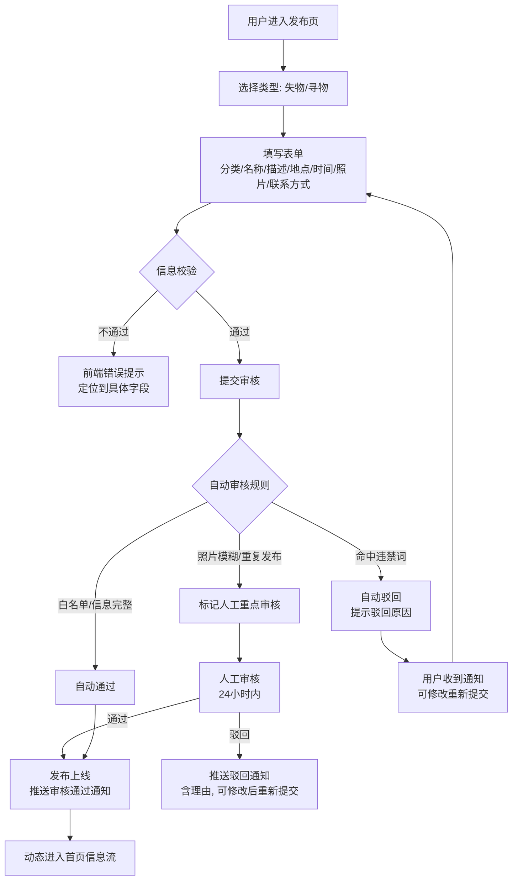
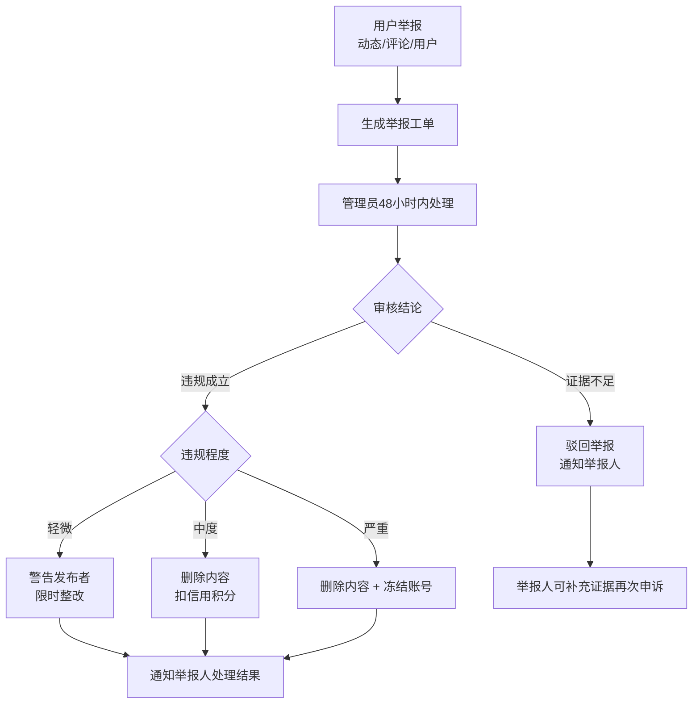

# 校园失物招领 App：产品需求文档（PRD）

| 项目 | 内容 |
|------|------|
| 文档名称 | 校园失物招领 App 产品需求文档 |
| 文档版本 | v1.0 |
| 状态 | 评审通过 |
| 关联文档 | 《校园失物招领App需求设计文档》（上游输入）、《DESIGN.md》（UI 设计系统） |
| 适用对象 | 产品、设计、开发、测试、运营 |

> **唯一事实依据声明**：本文档为本项目的唯一事实依据（SSOT）。上游需求设计文档为原始输入，若内容冲突，以本文档为准；任何功能范围、业务流程、验收标准的变更，须先更新本文档并经评审通过后方可实施。

---

## 一、产品概述

### 1.1 产品定位

一款面向高校师生的校园失物招领平台。以"发布-匹配-互动"为核心流程，解决校园内物品丢失后信息不对称、找回率低的问题。通过社区化互动机制、智能匹配推送与信用积分体系，提升失物归还效率，构建互助、可信的校园社区。

### 1.2 目标用户与价值

| 用户角色 | 说明 | 核心诉求 |
|----------|------|----------|
| 学生 | 在校本科生、研究生，主要使用群体 | 快速找到失物 / 便捷归还拾获物品 |
| 教师 | 任课教师、辅导员 | 高效找回遗失物品，减少教学事务干扰 |
| 教职工 | 行政、后勤、安保人员 | 规范拾获物品登记与归还流程 |
| 系统管理员 | 信息中心指定人员 | 审核内容、处理举报、维护平台秩序 |

### 1.3 产品价值主张

- **失主**：快速发布寻物信息，通过智能匹配与线索获取精准找回，提高找回概率
- **拾获者**：一键发布拾获信息，通过认领流程安全归还，获得信用激励
- **学校**：规范失物招领流程，降低管理成本，提升校园服务体验与口碑

### 1.4 产品核心指标（北极星指标）

| 指标 | 定义 | 目标值 |
|------|------|--------|
| 归还率 | 已完结动态 / 全部已审核动态 | 首版 ≥ 30%，稳定期 ≥ 45% |
| 平均找回时长 | 发布到确认归还的平均时间 | ≤ 48 小时 |
| 30 日留存 | 注册 30 天后仍活跃用户占比 | ≥ 25% |
| 审核通过率 | 人工审核通过占比 | ≥ 85% |

---

## 二、功能范围总览与 MVP 优先级

### 2.1 优先级定义

| 优先级 | 含义 | 对应版本 |
|--------|------|----------|
| P0 | 核心闭环必须项，缺失则产品不可用 | V1.0（MVP 首版） |
| P1 | 增强体验项，提升留存与转化 | V1.1~V1.3（迭代版） |
| P2 | 探索与远期能力，验证市场后推进 | V2.0（远期） |

### 2.2 功能范围总览

| 模块 | 功能点 | 优先级 | 版本 |
|------|--------|--------|------|
| **模块一：用户管理** | 注册（手机号/邮箱 + 角色认证） | P0 | V1.0 |
| | 登录（密码 / 验证码 / 自动续期 / 单设备在线） | P0 | V1.0 |
| | 个人信息管理 | P0 | V1.0 |
| | 账号安全（改密 / 换绑 / 注销） | P1 | V1.1 |
| | 华为账号第三方登录 | P2 | V2.0 |
| **模块二：首页与信息查找** | 首页信息流（搜索 + Banner + 快捷入口 + Tab 卡片流） | P0 | V1.0 |
| | 分类检索（8 大类 + 二级分类） | P0 | V1.0 |
| | 智能搜索（关键词 / 历史 / 热门 / 联想） | P0 | V1.0 |
| | 筛选与排序（分类 / 地点 / 时间 / 状态 / 校区） | P0 | V1.0 |
| | 扫一扫入口 | P1 | V1.2 |
| | 语音搜索 | P2 | V2.0 |
| **模块三：失物动态** | 失物发布（含审核） | P0 | V1.0 |
| | 失物动态列表 / 详情 | P0 | V1.0 |
| | 评论 / 点赞 | P0 | V1.0 |
| | 认领流程（申请 → 审核 → 归还确认） | P0 | V1.0 |
| | 转发 / 分享（App 内 / 海报 / 链接） | P1 | V1.1 |
| **模块四：寻物动态** | 寻物发布（含紧急程度 / 感谢方式） | P0 | V1.0 |
| | 寻物动态列表 / 详情 | P0 | V1.0 |
| | 提供线索流程 | P0 | V1.0 |
| | 感谢与反馈闭环 | P1 | V1.1 |
| **模块五：消息中心** | 系统通知 | P0 | V1.0 |
| | 匹配提醒（智能匹配规则） | P0 | V1.0 |
| | 互动消息 | P0 | V1.0 |
| | 私信（含防骚扰限制 / 拉黑） | P0 | V1.0 |
| **模块六：我的主页** | 个人资料页 | P0 | V1.0 |
| | 我的发布 / 我的认领 / 我的线索 | P0 | V1.0 |
| | 收藏与足迹 | P1 | V1.1 |
| | 信用积分体系（规则 + 等级权益） | P0 | V1.0 |
| | 设置（消息 / 隐私 / 主题 / 退出） | P0 | V1.0 |
| **模块七：系统管理** | 用户管理 | P0 | V1.0 |
| | 信息审核（人工 + 自动规则） | P0 | V1.0 |
| | 举报处理 | P0 | V1.0 |
| | 数据统计（含周报/月报导出） | P1 | V1.2 |
| | 系统配置（分类 / 地点 / 违禁词 / 公告 / 积分规则） | P1 | V1.1 |

---

## 三、用户角色与权限矩阵

| 功能 | 游客 | 学生 | 教师 | 教职工 | 管理员 |
|------|:----:|:----:|:----:|:------:|:------:|
| 浏览 / 搜索动态 | ✅ | ✅ | ✅ | ✅ | ✅ |
| 注册 / 登录 | ✅ | - | - | - | - |
| 发布动态 | ❌ | ✅ | ✅ | ✅ | ✅ |
| 评论 / 点赞 | ❌ | ✅ | ✅ | ✅ | ✅ |
| 认领 / 提供线索 | ❌ | ✅ | ✅ | ✅ | ✅ |
| 私信 | ❌ | ✅ | ✅ | ✅ | ✅ |
| 修改个人信息 | ❌ | ✅ | ✅ | ✅ | ✅ |
| 举报 | ❌ | ✅ | ✅ | ✅ | ✅ |
| 收藏动态 | ❌ | ✅ | ✅ | ✅ | ✅ |
| 审核 / 举报处理 / 用户管理 / 数据统计 / 系统配置 | ❌ | ❌ | ❌ | ❌ | ✅ |

**权限规则补充**：
1. 游客仅可浏览与搜索；未登录点击发布、评论等受限操作时，弹出登录引导 Toast。
2. 学生 / 教师 / 教职工的普通用户功能权限一致，差异仅体现在认证字段与展示。
3. 管理员账号由系统初始化或超级管理员指派，不允许自主注册。
4. 被冻结账号禁止登录，登录接口返回"账号已冻结，请联系管理员"。

---

## 四、核心业务流程

### 4.1 发布-审核-上线流程（失物 / 寻物通用）



### 4.2 认领闭环流程

```mermaid
flowchart TD
    A[认领人点击"这是我的"] --> B[填写认领说明<br/>回答发布者设置的特征验证问题]
    B --> C[提交认领申请]
    C --> D[发布者收到认领通知]
    D --> E{发布者审核}
    E -- 同意 --> F[双方联系方式互见]
    F --> G[线下归还]
    G --> H{归还确认}
    H -- 双方确认 --> I[状态置为"已归还"<br/>发布者+30分, 认领人+20分]
    H -- 一方未确认 --> J[7天后自动确认<br/>可申诉人工介入]
    E -- 拒绝 --> K[认领人收到拒绝通知<br/>可再次申请或申诉]
    K --> D
```

**防冒领机制**：
- 发布者可在发布时设置 1 个特征验证问题（如"包内有什么"），认领人必须作答
- 认领申请对发布者展示认领人认证信息（学号 + 姓名 + 院系）
- 单条动态允许多人认领，由发布者最终确认；已被同意后其他认领申请自动关闭
- 冒领查实扣 50 分并记录违规

### 4.3 线索闭环流程

```mermaid
flowchart TD
    A[用户点击"提供线索"] --> B[填写线索描述<br/>看到/捡到的地点、当前状态]
    B --> C[上传照片(可选)]
    C --> D[提交线索]
    D --> E[失主收到线索通知]
    E --> F{线索有效性}
    F -- 有效 --> G[失主与线索提供者私信沟通]
    G --> H[找回物品]
    H --> I[失主标记"已找回"<br/>线索有效+10分]
    F -- 无效 --> J[失主标记无效<br/>线索提供者收到反馈]
```

### 4.4 举报处理流程



### 4.5 智能匹配推送流程

```mermaid
flowchart TD
    A[用户发布寻物动态] --> B[匹配引擎扫描失物动态]
    B --> C{匹配度计算}
    C -- 分类+地点+时间吻合 --> D[高匹配度推送]
    C -- 分类+地点吻合 --> E[中匹配度推送]
    C -- 仅分类吻合 --> F[低匹配度推送]
    D --> G[消息中心"匹配提醒"<br/>按匹配度排序展示]
    E --> G
    F --> G
    G --> H[用户点击跳转对应动态详情]
    H --> I{是否找回}
    I -- 是 --> J[标记已找回<br/>关闭匹配提醒]
    I -- 否 --> K[匹配提醒持续展示7天]
```

---

## 五、详细功能需求

### 5.1 模块一：用户管理

#### 5.1.1 注册（P0）

| 规则项 | 说明 |
|--------|------|
| 注册方式 | 手机号注册（优先）、学校邮箱注册 |
| 身份选择 | 学生 / 教师 / 教职工，注册时选择，提交后不可自行修改（需管理员变更） |
| 学生认证字段 | 学号 + 姓名 + 所在院系 + 入学年份 |
| 教师认证字段 | 工号 + 姓名 + 所在院系 |
| 教职工认证字段 | 工号 + 姓名 + 所属部门 |
| 密码规则 | 8~20 位，须同时包含字母与数字 |
| 验证码 | 手机短信验证码 / 邮箱验证码，有效期 5 分钟，60 秒可重发，单日单号上限 10 次 |
| 协议 | 须勾选同意《用户协议》和《隐私政策》后方可提交 |
| 认证时效 | 注册即认证通过（学工号格式校验 + 院系库匹配）；格式不匹配自动驳回并提示 |

**验收标准**：
1. 正确填写全部必填字段 + 有效验证码 → 注册成功并自动登录跳转首页
2. 验证码错误 / 超时 → 明确报错，不消耗注册额度
3. 手机号或邮箱已注册 → 提示"该账号已注册，请直接登录"
4. 学号 / 工号格式非法 → 表单级报错，不提交

#### 5.1.2 登录（P0）

| 规则项 | 说明 |
|--------|------|
| 登录方式 | 手机号 + 密码、手机号 + 验证码、邮箱 + 密码 |
| 第三方登录 | 预留华为账号登录接口（P2） |
| 自动登录 | Token 自动续期，7 天内免登录 |
| 失败提示 | 区分"账号不存在 / 密码错误 / 账号已冻结"；密码连续错 5 次锁定 30 分钟 |
| 多设备 | 同一账号仅允许一台设备在线，新登录挤掉旧登录并通知旧设备 |

**验收标准**：
1. 正确凭证 → 1 秒内返回 Token，进入首页
2. 密码错误 → 明确提示剩余可尝试次数；触发锁定时提示解锁时间
3. 冻结账号登录 → 返回"账号已冻结，请联系管理员"
4. 新设备登录后，旧设备再次操作 → 提示"已在其他设备登录"并引导重新登录

#### 5.1.3 个人信息管理（P0）

| 字段 | 必填 | 规则 |
|------|:----:|------|
| 头像 | 否 | 未设置时按角色生成默认头像 |
| 昵称 | 是 | 2~16 字符，全平台唯一，占用即冲突提示 |
| 真实姓名 | 是 | 认证时填写，他人不可见 |
| 学号 / 工号 | 是 | 认证时填写，他人不可见 |
| 院系 / 部门 | 是 | 对外展示 |
| 年级（学生） | 是 | 如"2024 级" |
| 联系方式 | 否 | 手机号 / 微信，发布动态时可选是否展示 |
| 校区 | 是 | 主校区 / 分校区，用于区域筛选 |
| 个人简介 | 否 | 一句话简介，最多 100 字（对外展示） |

**验收标准**：每个字段修改即时生效并同步缓存；昵称冲突实时提示；敏感字段（姓名 / 学号 / 工号）仅本人可见。

#### 5.1.4 账号安全（P1 / V1.1）

- 修改密码：需验证原密码或手机验证码
- 绑定 / 换绑手机号：新号验证码二次校验
- 绑定 / 换绑邮箱：新邮箱验证码二次校验
- 账号注销：须确认无未完结的失物 / 寻物记录；注销后 7 天冷静期可撤销

### 5.2 模块二：首页与信息查找

#### 5.2.1 首页信息流（P0）

| 区域 | 内容与规则 |
|------|------------|
| 顶部搜索栏 | 搜索框（点击进入搜索页）+ 扫一扫入口（P1） |
| Banner 区 | 公告通知、寻物急件、热点失物轮播，自动轮播 5 秒，可手动切换 |
| 快捷入口 | 发布失物 / 发布寻物 / 扫一扫 / 智能匹配，2×2 宫格 |
| Tab 切换 | 失物动态 / 寻物动态 / 最新发布 / 附近，默认"最新发布" |
| 信息卡片流 | 卡片式动态列表；下拉刷新、上拉加载；首屏 ≤ 2 秒 |

**智能匹配入口**：进入后展示系统根据"我发布的寻物"匹配的失物列表（V1.0 范围）。

#### 5.2.2 分类检索（P0）

| 一级分类 | 二级分类示例 |
|----------|-------------|
| 证件卡类 | 身份证、学生证、校园卡、银行卡、驾照、其他证件 |
| 电子数码 | 手机、平板、耳机、U 盘、充电宝、手表、其他数码 |
| 钥匙钱包 | 钥匙、钱包、卡包、校园卡套 |
| 书本文具 | 教材、笔记本、笔袋、文件袋 |
| 衣物配饰 | 外套、围巾、帽子、手套、雨伞、书包 |
| 运动器材 | 球类、球拍、滑板、瑜伽垫 |
| 生活用品 | 水杯、眼镜、化妆品、药品 |
| 其他 | 以上均不属于的物品 |

分类数据由管理端"分类管理"动态维护，客户端缓存同步。

#### 5.2.3 智能搜索（P0）

| 能力 | 规则 |
|------|------|
| 关键词搜索 | 物品名称、地点、描述模糊搜索，支持多关键词空格分词 |
| 搜索历史 | 保留最近 20 条，可单条删除 / 全部清空 |
| 热门搜索 | 近 7 天高频搜索词 Top 10，每天刷新 |
| 搜索建议 | 输入时实时联想补全（防抖 300ms），展示匹配分类与地点标签 |
| 语音搜索 | P2，预留接口 |

**验收标准**：搜索响应 ≤ 1 秒；输入"图书馆 耳机"能命中同时包含两者的动态，结果按相关度排序。

#### 5.2.4 筛选与排序（P0）

| 筛选维度 | 选项 |
|----------|------|
| 物品分类 | 一级 + 二级级联 |
| 地点 | 教学楼、食堂、图书馆、宿舍区、操场、校门口、其他（管理端可维护） |
| 时间范围 | 今天 / 3 天内 / 一周内 / 一个月内 / 自定义 |
| 状态 | 待认领 / 认领中 / 已归还 / 已关闭 |
| 校区 | 主校区 / 分校区 |

| 排序方式 | 规则 |
|----------|------|
| 最新发布 | 发布时间倒序 |
| 距我最近 | 按拾获 / 丢失地点距当前位置距离（需授权定位） |
| 最热动态 | 按互动量（评论 + 点赞）降序 |

筛选条件可多选组合，刷新时保持筛选状态；"附近"Tab 默认按距我最近排序。

### 5.3 模块三：失物动态

> 场景：我捡到了别人丢失的物品，想发布信息帮其找回。

#### 5.3.1 失物发布（P0）

| 字段 | 必填 | 规则 |
|------|:----:|------|
| 物品分类 | 是 | 一级 + 二级级联选择 |
| 物品名称 | 是 | 简短描述，如"华为 Mate60 手机"，≤ 30 字 |
| 物品描述 | 是 | 物品特征（颜色 / 型号 / 破损等），10~500 字 |
| 拾获地点 | 是 | 地图选点 + 文字描述 |
| 拾获时间 | 是 | 日期 + 时段选择，不得晚于当前时间 |
| 物品照片 | 是 | 1~9 张，至少 1 张，支持拍照 / 相册，单张 ≤ 10MB |
| 联系方式 | 是 | App 内私信 / 手机号 / 微信号，三选一 |
| 当前存放地 | 否 | 如"已交保卫处前台" |
| 悬赏状态 | 否 | 是否提供感谢金（金额自填，展示为标签） |
| 匿名发布 | 否 | 默认实名，可切换匿名；匿名时对外隐藏昵称与头像，认证信息后台可见 |
| 认领验证问题 | 否 | 认领防冒领特征验证，发布者可设置 |

**发布流程**：选择分类 → 填写信息 → 上传照片 → 预览确认 → 提交审核 → 审核通过 → 发布上线。

**验收标准**：
1. 照片少于 1 张 / 必填缺失 → 阻止提交并定位字段
2. 图片数量超过 9 张 → 提示上限
3. 提交后进入"待审核"，前端展示审核中状态，审核通过推送通知

#### 5.3.2 失物动态列表 / 详情（P0）

卡片元素：发布者头像昵称（可跳主页）· 相对时间 · 分类标签 + 状态标签（待认领 / 认领中 / 已归还）· 物品名称（粗体）· 描述截断两行 · 首图缩略图 · 拾获地点（点击开地图）· 互动栏（评论 / 点赞 / 转发）· "这是我的"认领入口。

详情页：完整描述 + 全部图片（左右滑动）+ 验证问题展示（认领时作答）+ 评论区 + 操作区（认领 / 私信发布者 / 收藏 / 分享 / 举报）。

#### 5.3.3 互动功能（P0 评论 / 点赞，P1 转发）

**评论**：

| 功能 | 规则 |
|------|------|
| 发表评论 | 文字，最多 200 字，含敏感词自动拦截 |
| 回复评论 | 楼中楼嵌套最多 2 层 |
| 删除评论 | 仅可删除自己的评论；被删除后子回复一并隐藏 |
| 举报评论 | 提交管理员审核，5 种举报类型 |

**点赞**：每人每条仅 1 次，再点取消；实时计数；点击计数查看点赞用户列表。

**转发 / 分享（P1）**：App 内转发到个人主页（带"转发自 @用户"标注）；生成海报分享微信；生成链接分享 QQ；复制链接。

#### 5.3.4 认领流程（P0）

详见 4.2 认领闭环流程。关键规则：
- 认领人须登录且已完成角色认证
- 认领说明 ≥ 20 字；验证问题须作答
- 发布者审核时可见认领人认证信息
- 认领同意后状态置为"认领中"，双方联系方式互见
- 归还确认：双方确认后置"已归还"；超 7 天未确认可申诉人工处理
- 认领申请 48 小时未处理 → 发布者被扣 5 分（超时提醒）

### 5.4 模块四：寻物动态

> 场景：我丢失了物品，想发布信息寻求帮助。

#### 5.4.1 寻物发布（P0）

| 字段 | 必填 | 规则 |
|------|:----:|------|
| 物品分类 | 是 | 一级 + 二级 |
| 物品名称 | 是 | ≤ 30 字 |
| 丢失描述 | 是 | 丢失经过 + 物品特征，10~500 字 |
| 丢失地点 | 是 | 地图选点 + 文字描述 |
| 丢失时间 | 是 | 日期 + 时段，不得晚于当前时间 |
| 物品照片 | 否 | 同款参考图，0~9 张 |
| 感谢方式 | 否 | 口头感谢 / 请喝奶茶 / 感谢金（自填金额） |
| 联系方式 | 是 | 私信 / 手机号 / 微信号三选一 |
| 紧急程度 | 是 | 普通 / 加急；加急动态首页优先展示并带"急"标签，加急置顶最长 3 天 |
| 匿名发布 | 否 | 同失物发布 |

**验收标准**：加急标识在首页信息流排序中优先级高于普通动态；加急过期后自动降级。

#### 5.4.2 寻物动态列表 / 详情（P0）

展示形式与失物动态一致，额外元素：紧急"急"标签、感谢方式标签、"我看到了 / 我捡到了"线索入口按钮。

#### 5.4.3 提供线索（P0）

详见 4.3 线索闭环流程。关键规则：
- 线索描述 ≥ 10 字，照片可选
- 线索提交后失主收到通知，双方可通过私信沟通
- 失主标记有效 → 提供者 +10 分；标记无效 → 提供者收到反馈，不扣分
- 同一动态同一用户可多次补充线索

#### 5.4.4 感谢与反馈闭环（P1 / V1.1）

- 找回后失主可发布"感谢动态"（模板 + 可 @ 帮助者）
- 感谢打赏以积分形式赠送（从我的积分扣除，单次最少 5 分）
- 帮助者收到感谢通知，信用积分 +5

### 5.5 模块五：消息中心

#### 5.5.1 消息分类与规则

| 分类 | 通知类型 | 优先级 |
|------|----------|:------:|
| 系统通知（P0） | 审核结果、认证通过、密码修改、异地登录、活动公告、违规警告 | 中 |
| 匹配提醒（P0） | 失物匹配 / 寻物匹配 / 附近动态（可关闭） | 高 |
| 互动消息（P0） | 评论、回复、点赞、认领申请、线索 | 中 |
| 私信（P0） | 一对一对话 | 高 |

**智能匹配规则**：
- 分类相同 + 地点相近 + 时间吻合 → 高匹配度
- 分类相同 + 地点相近 → 中匹配度
- 分类相同 → 低匹配度

#### 5.5.2 私信规则（P0）

| 规则 | 说明 |
|------|------|
| 发起入口 | 动态详情页 / 用户主页"私信"按钮 |
| 消息类型 | 文字 ≤ 500 字、图片 |
| 状态 | 已发送 / 已读（回执） |
| 防骚扰 | 非互关用户每天最多向同一用户发起 3 次首条私信 |
| 拉黑 | 拉黑后双方无法互发私信，历史消息保留 |
| 敏感词 | 私信内容自动过滤，命中即拦截发送 |
| 未读角标 | 底部 Tab 与消息列表红点 / 数字角标 |

**验收标准**：高优先级消息推送延迟 ≤ 5 秒；角标数字与实际未读数一致，已读后角标消除。

### 5.6 模块六：我的主页

#### 5.6.1 个人资料页（P0）

对外展示：头像 + 昵称 · 角色 + 院系（如"学生 · 计算机学院"）· 校区标签 · 信用积分 + 等级徽章 · 统计数据（发布数 / 帮助数 / 获赞数）· 个人简介 · 动态列表（按时间倒序，Tab 分失物 / 寻物）。

#### 5.6.2 我的发布（P0）

按状态分组：待审核 / 进行中 / 已完结 / 已关闭。支持：
- 编辑未审核与进行中动态（编辑后需重新审核）
- 关闭进行中动态（需二次确认）
- 查看审核驳回理由并一键复制修改

#### 5.6.3 我的认领 / 线索（P0）

| 分类 | 内容 |
|------|------|
| 认领记录 | 我提交的认领申请及状态（待审核 / 已同意 / 已拒绝 / 已取消） |
| 线索记录 | 我提供的线索及反馈（有效 / 无效 / 待处理） |

#### 5.6.4 收藏与足迹（P1 / V1.1）

- 收藏动态：收藏感兴趣的失物 / 寻物动态，收藏列表
- 浏览足迹：最近浏览记录，最多保留 100 条，可清空

#### 5.6.5 信用积分体系（P0）

| 事件 | 积分 |
|------|:----:|
| 实名认证通过 | +20 |
| 发布失物 / 寻物 | +5（每日上限 3 次） |
| 成功归还物品（发布者确认） | +30 |
| 成功找回物品（失主确认） | +20 |
| 提供有效线索 | +10 |
| 发布感谢动态 | +5 |
| 被举报且成立 | -20 |
| 冒领物品（查实） | -50 |
| 超时未处理认领申请 | -5 |

**积分等级**：

| 等级 | 积分范围 | 称号 | 权益 |
|:----:|----------|------|------|
| 1 级 | 0~50 | 新人 | 基础功能 |
| 2 级 | 51~150 | 热心同学 | 动态置顶 1 次 / 周 |
| 3 级 | 151~300 | 校园达人 | 动态置顶 3 次 / 周 |
| 4 级 | 301~500 | 失物克星 | 专属头像框 |
| 5 级 | 500+ | 校园守护者 | 专属标识 + 优先客服 |

**验收标准**：积分变动实时更新并记录明细（时间 / 事件 / 变动值）；等级提升触发徽章动画与通知。

#### 5.6.6 设置（P0）

| 功能 | 说明 |
|------|------|
| 消息设置 | 各类通知开关（含"附近动态推送"） |
| 隐私设置 | 是否展示院系、是否允许陌生人私信 |
| 主题设置 | 浅色 / 深色模式切换 |
| 清除缓存 | 清除本地缓存数据 |
| 关于我们 | 版本号、用户协议、隐私政策 |
| 退出登录 | 清除本地登录状态，二次确认 |

### 5.7 模块七：系统管理（管理员端）

#### 5.7.1 用户管理（P0）

| 功能 | 说明 |
|------|------|
| 用户列表 | 按角色 / 院系 / 状态筛选，支持分页 |
| 用户详情 | 认证信息、发布记录、认领记录、违规记录 |
| 用户冻结 / 解冻 | 冻结期间无法登录；解冻恢复 |
| 强制注销 | 永久注销严重违规账号（二次确认） |
| 角色变更 | 普通用户提升为管理员，或降级 |

#### 5.7.2 信息审核（P0）

| 功能 | 说明 |
|------|------|
| 待审核列表 | 按提交时间排序，标注自动审核命中项 |
| 审核操作 | 通过 / 驳回（驳回须填写理由） |
| 批量审核 | 支持批量选中通过 |
| 审核标准 | 信息完整性、照片清晰度、描述真实性、敏感信息 |
| 审核时效 | 发布后 24 小时内完成审核 |

**自动审核规则**：

| 规则 | 处理 |
|------|------|
| 含有违禁词 | 自动驳回 |
| 照片模糊 / 不清晰 | 标记为需人工重点审核 |
| 同一用户短时间重复发布 | 标记为需人工审核 |
| 信息完整度高 + 信用积分高 | 自动通过（白名单机制） |

#### 5.7.3 举报处理（P0）

| 功能 | 说明 |
|------|------|
| 举报列表 | 按时间排序，支持状态筛选 |
| 举报类型 | 虚假信息 / 冒领行为 / 骚扰信息 / 不良内容 / 其他 |
| 处理操作 | 驳回举报 / 警告发布者 / 删除动态 / 冻结用户 |
| 处理时效 | 48 小时内完成处理 |
| 举报人反馈 | 处理结果通知举报人 |

#### 5.7.4 数据统计（P1 / V1.2）

| 统计维度 | 指标 |
|----------|------|
| 用户数据 | 注册用户数、日活 / 月活、各角色占比、各院系占比 |
| 发布数据 | 失物发布量、寻物发布量、日均发布量 |
| 匹配数据 | 成功归还数、归还率、平均找回时长 |
| 互动数据 | 评论数、点赞数、私信数 |
| 审核数据 | 审核通过率、平均审核时长 |
| 举报数据 | 举报量、处理率 |

支持导出周报 / 月报（Excel / PDF）。

#### 5.7.5 系统配置（P1 / V1.1）

| 配置项 | 说明 |
|--------|------|
| 审核开关 | 开启 / 关闭人工审核（关闭后自动通过） |
| 分类管理 | 增删改物品分类 |
| 地点管理 | 维护校园地点标签 |
| 违禁词库 | 维护敏感词 / 违禁词列表 |
| 公告管理 | 发布 / 编辑 / 删除系统公告 |
| 动态有效期 | 设置动态自动关闭时间（默认 30 天） |
| 积分规则 | 调整积分获取 / 扣除规则 |

---

## 六、页面清单（28 页）

| 编号 | 页面名称 | 页面路径 | 说明 | 优先级 |
|------|----------|----------|------|:------:|
| P01 | 启动页 | /splash | 品牌展示，2 秒自动跳转 | P0 |
| P02 | 登录页 | /login | 手机号 / 邮箱登录 | P0 |
| P03 | 注册页 | /register | 分步注册（角色 → 信息 → 验证） | P0 |
| P04 | 找回密码 | /forgot-password | 手机验证码重置密码 | P0 |
| P05 | 首页 | /home | 信息流 + 搜索 + 分类入口 | P0 |
| P06 | 搜索页 | /search | 搜索 + 筛选 + 结果列表 | P0 |
| P07 | 失物动态列表 | /lost-list | 失物动态 Tab 页 | P0 |
| P08 | 寻物动态列表 | /found-list | 寻物动态 Tab 页 | P0 |
| P09 | 动态详情页 | /post-detail/:id | 详情 + 评论区 + 操作按钮 | P0 |
| P10 | 发布失物 | /post-lost | 表单页 | P0 |
| P11 | 发布寻物 | /post-found | 表单页 | P0 |
| P12 | 认领页 | /claim/:postId | 认领申请表单 | P0 |
| P13 | 提供线索页 | /clue/:postId | 线索提供表单 | P0 |
| P14 | 消息中心 | /messages | 消息 Tab 列表 | P0 |
| P15 | 私信对话页 | /chat/:userId | 一对一私信 | P0 |
| P16 | 我的主页 | /profile/:userId | 个人主页 | P0 |
| P17 | 我的发布 | /my-posts | 发布管理列表 | P0 |
| P18 | 我的认领 | /my-claims | 认领记录列表 | P0 |
| P19 | 收藏与足迹 | /favorites | 收藏 + 浏览历史 | P1 |
| P20 | 信用积分 | /credit | 积分明细 + 等级 | P0 |
| P21 | 个人信息编辑 | /edit-profile | 资料编辑表单 | P0 |
| P22 | 设置页 | /settings | 设置项列表 | P0 |
| P23 | 管理员-审核列表 | /admin/audit | 待审核信息列表 | P0 |
| P24 | 管理员-审核详情 | /admin/audit/:id | 审核操作页 | P0 |
| P25 | 管理员-用户管理 | /admin/users | 用户管理列表 | P0 |
| P26 | 管理员-举报处理 | /admin/reports | 举报列表 + 处理 | P0 |
| P27 | 管理员-数据统计 | /admin/stats | 数据看板 | P1 |
| P28 | 管理员-系统配置 | /admin/config | 系统参数配置 | P1 |

---

## 七、数据模型设计

### 7.1 核心实体关系

```
用户(User) 1 ──→ N 发布动态(Post)
用户(User) 1 ──→ N 评论(Comment)
用户(User) 1 ──→ N 点赞(Like)
用户(User) 1 ──→ N 私信(Message)
用户(User) 1 ──→ N 积分明细(CreditLog)
动态(Post) 1 ──→ N 评论(Comment)
动态(Post) 1 ──→ N 点赞(Like)
动态(Post) 1 ──→ N 认领申请(Claim)
动态(Post) 1 ──→ N 线索(Clue)
```

共 9 张核心数据表：user、post、comment、like、claim、clue、message、credit_log、report。

### 7.2 核心数据表

#### 用户表（user）

| 字段 | 类型 | 说明 |
|------|------|------|
| id | string | 用户唯一 ID |
| phone | string | 手机号（加密存储） |
| email | string | 邮箱 |
| password_hash | string | 密码哈希 |
| salt | string | 密码盐 |
| nickname | string | 昵称 |
| avatar | string | 头像 URL |
| real_name | string | 真实姓名（加密存储） |
| student_id | string | 学号 / 工号（加密存储） |
| role | enum | student / teacher / staff / admin |
| department | string | 院系 / 部门 |
| campus | string | 校区 |
| grade | string | 年级（学生） |
| credit_score | number | 信用积分 |
| status | enum | normal / frozen / deleted |
| created_at | datetime | 注册时间 |
| last_login | datetime | 最后登录时间 |

#### 动态表（post）

| 字段 | 类型 | 说明 |
|------|------|------|
| id | string | 动态唯一 ID |
| user_id | string | 发布者 ID |
| type | enum | lost（失物）/ found（寻物） |
| category_1 | string | 一级分类 |
| category_2 | string | 二级分类 |
| title | string | 物品名称 |
| description | string | 详细描述 |
| images | string[] | 照片 URL 数组 |
| location | object | { lat, lng, address, detail } |
| location_tag | string | 地点标签（教学楼 / 食堂等） |
| occurred_at | datetime | 丢失 / 拾获时间 |
| contact_type | enum | pm / phone / wechat |
| contact_value | string | 联系方式值 |
| storage_location | string | 暂存地点 |
| reward | string | 感谢方式 / 悬赏 |
| urgency | enum | normal / urgent |
| is_anonymous | boolean | 是否匿名 |
| status | enum | pending / active / claiming / resolved / closed |
| verify_question | string | 认领验证问题 |
| view_count | number | 浏览次数 |
| like_count | number | 点赞数 |
| comment_count | number | 评论数 |
| share_count | number | 转发数 |
| audit_status | enum | pending / approved / rejected |
| audit_remark | string | 审核备注 |
| created_at | datetime | 发布时间 |
| updated_at | datetime | 更新时间 |
| expire_at | datetime | 过期时间 |

#### 评论表（comment）

| 字段 | 类型 | 说明 |
|------|------|------|
| id | string | 评论 ID |
| post_id | string | 动态 ID |
| user_id | string | 评论者 ID |
| content | string | 评论内容 |
| parent_id | string | 父评论 ID（null 为顶级评论） |
| reply_to_user_id | string | 回复的目标用户 ID |
| like_count | number | 点赞数 |
| status | enum | normal / hidden / deleted |
| created_at | datetime | 评论时间 |

#### 点赞表（like）

| 字段 | 类型 | 说明 |
|------|------|------|
| id | string | 点赞 ID |
| user_id | string | 点赞者 ID |
| target_id | string | 目标 ID（动态或评论 ID） |
| target_type | enum | post / comment |
| created_at | datetime | 点赞时间 |

#### 认领申请表（claim）

| 字段 | 类型 | 说明 |
|------|------|------|
| id | string | 认领 ID |
| post_id | string | 动态 ID |
| claimant_id | string | 认领人 ID |
| description | string | 认领说明 |
| verify_answer | string | 验证问题答案 |
| status | enum | pending / approved / rejected / cancelled |
| created_at | datetime | 申请时间 |
| resolved_at | datetime | 处理时间 |

#### 线索表（clue）

| 字段 | 类型 | 说明 |
|------|------|------|
| id | string | 线索 ID |
| post_id | string | 寻物动态 ID |
| provider_id | string | 提供者 ID |
| content | string | 线索描述 |
| images | string[] | 照片 URL 数组 |
| is_helpful | boolean | 失主是否标记为有用 |
| created_at | datetime | 提供时间 |

#### 私信表（message）

| 字段 | 类型 | 说明 |
|------|------|------|
| id | string | 消息 ID |
| from_user_id | string | 发送者 ID |
| to_user_id | string | 接收者 ID |
| content | string | 消息内容 |
| msg_type | enum | text / image |
| is_read | boolean | 是否已读 |
| created_at | datetime | 发送时间 |

#### 积分明细表（credit_log）

| 字段 | 类型 | 说明 |
|------|------|------|
| id | string | 明细 ID |
| user_id | string | 用户 ID |
| change | number | 积分变动值（正为增加，负为扣除） |
| event_type | enum | register / post / return / find / clue / thank / reported / fraud / timeout |
| description | string | 事件描述 |
| balance | number | 变动后余额 |
| created_at | datetime | 变动时间 |

#### 举报表（report）

| 字段 | 类型 | 说明 |
|------|------|------|
| id | string | 举报 ID |
| reporter_id | string | 举报人 ID |
| target_id | string | 被举报对象 ID |
| target_type | enum | post / comment / user |
| reason | enum | fake / fraud / harass / inappropriate / other |
| description | string | 详细说明 |
| status | enum | pending / dismissed / warned / deleted / frozen |
| handler_id | string | 处理管理员 ID |
| result | string | 处理结果说明 |
| created_at | datetime | 举报时间 |
| handled_at | datetime | 处理时间 |

---

## 八、非功能性需求

### 8.1 性能需求

| 指标 | 要求 | 验收方式 |
|------|------|----------|
| 页面加载时间 | 首屏 ≤ 2 秒 | 冷启动埋点统计 |
| 搜索响应时间 | ≤ 1 秒 | 接口压测 |
| 图片加载 | 缩略图 ≤ 1 秒，原图 ≤ 3 秒 | 弱网模拟测试 |
| 并发用户数 | 支持 5000+ 同时在线 | 压测工具验证 |
| 消息推送延迟 | ≤ 5 秒 | 推送链路抽样 |

### 8.2 安全需求

| 需求 | 说明 |
|------|------|
| 数据传输 | 全程 HTTPS 加密 |
| 密码存储 | 密码加盐哈希存储，禁止明文 |
| 隐私保护 | 学号 / 工号 / 手机号等敏感信息脱敏展示 |
| 防刷机制 | 接口限流、验证码防刷 |
| 内容安全 | 敏感词过滤 + 人工审核双重保障 |
| 权限控制 | 基于角色的访问控制（RBAC），后端二次鉴权 |

### 8.3 可用性需求

| 需求 | 说明 |
|------|------|
| 离线缓存 | 已加载数据本地缓存，弱网可查看 |
| 断网提示 | 网络异常时友好提示 + 重试 |
| 无障碍 | 支持字体缩放、高对比度模式（详见 DESIGN.md） |
| 多语言 | 预留国际化接口（首版仅中文） |

### 8.4 兼容性需求

| 项目 | 要求 |
|------|------|
| 系统 | HarmonyOS 5.0+（API 12+） |
| 设备 | 手机为主，兼容平板 |
| 屏幕 | 适配不同尺寸与分辨率 |

---

## 九、验收标准总表

### 9.1 核心闭环验收

| 编号 | 验收项 | 验收标准 |
|:----:|--------|----------|
| AC-01 | 发布闭环 | 用户可完成失物 / 寻物发布全流程，动态在审核通过后进入信息流，全链路 ≤ 2 分钟 |
| AC-02 | 认领闭环 | 认领申请 → 发布者审核 → 同意 → 归还确认 → 状态"已归还"，全流程可追踪每一步状态 |
| AC-03 | 线索闭环 | 线索提交后失主收到通知，标记有效 / 无效后积分即时生效 |
| AC-04 | 匹配推送 | 发布寻物后 10 分钟内收到同类失物匹配提醒（分类 + 地点命中时） |
| AC-05 | 举报闭环 | 举报工单 48 小时内处理完毕，处理结果通知举报人 |

### 9.2 分模块验收（抽检项）

| 模块 | 验收项 | 验收标准 |
|------|--------|----------|
| 用户管理 | 注册认证 | 三种角色均可用对应字段注册并认证；学工号格式非法无法提交 |
| 用户管理 | 单设备在线 | 新登录挤掉旧登录，旧设备操作收到提示 |
| 首页查找 | 筛选组合 | 分类 × 地点 × 时间 × 状态任意组合结果正确，无错漏 |
| 首页查找 | 搜索联想 | 输入 1 个字符即出现联想建议，命中率 ≥ 90% |
| 失物动态 | 认领防冒领 | 认领未回答验证问题无法提交；发布者可查看认领人认证信息 |
| 寻物动态 | 加急置顶 | 加急动态排序优先，3 天后自动降级 |
| 消息中心 | 私信限制 | 非互关用户超 3 次首条私信被拦截并提示 |
| 我的主页 | 积分规则 | 9 类积分事件触发均按规则变动，明细可查 |
| 系统管理 | 自动审核 | 含违禁词动态自动驳回；白名单用户高完整度动态自动通过 |
| 系统管理 | 审核时效 | 24 小时内完成人工审核，超时自动预警 |

### 9.3 通用验收

| 编号 | 验收项 | 验收标准 |
|:----:|--------|----------|
| AC-06 | 未登录拦截 | 游客点击受限操作均出现登录引导，不产生错误页面 |
| AC-07 | 敏感词 | 发布 / 评论 / 私信内容命中敏感词被拦截或替换 |
| AC-08 | 断网 | 断网时友好提示并可重试，已缓存内容可浏览 |
| AC-09 | 深色模式 | 深色模式切换后全局配色符合 DESIGN.md 规范，无对比度异常 |

---

## 十、版本迭代规划

### 10.1 版本规划

| 版本 | 定位 | 范围 | 目标 |
|------|------|------|------|
| V1.0 | MVP 首版 | 全部 P0：用户管理核心、首页信息流、搜索筛选、失物 / 寻物发布、认领 / 线索闭环、评论点赞、消息中心、我的主页、信用积分、管理端审核 / 用户 / 举报 | 完成核心闭环，验证产品价值 |
| V1.1 | 体验增强 | P1：账号安全、转发分享、感谢闭环、收藏足迹、系统配置 | 提升留存与互助氛围 |
| V1.2 | 效率提升 | P1：数据统计看板、扫一扫入口 | 支撑运营与管理决策 |
| V1.3 | 稳定性加固 | 性能优化、安全加固、无障碍完善 | 提升体验质量 |
| V2.0 | 平台化 | P2：华为账号登录、语音搜索、二维码标签、平板深度适配 | 生态扩展与创新探索 |

### 10.2 里程碑（与需求文档对齐，13 周）

| 阶段 | 时间 | 交付内容 |
|------|------|----------|
| 需求确认 | 第 1~2 周 | 本文档评审通过、原型设计 |
| UI 设计 | 第 3~4 周 | 全部页面 UI 设计稿，依据 DESIGN.md |
| 后端开发 | 第 3~8 周 | API 开发、数据库部署、管理后台 |
| 客户端开发 | 第 5~10 周 | 核心页面开发、接口联调 |
| 测试 | 第 9~11 周 | 功能测试（对照本文档 AC）、性能测试、安全测试 |
| 试运行 | 第 12 周 | 小范围试运行、Bug 修复 |
| 正式上线 | 第 13 周 | 全校推广 |

---

## 附录 A：变更记录

| 版本 | 日期 | 变更内容 | 变更人 |
|------|------|----------|--------|
| v1.0 | 2026-08-03 | 首次发布，作为唯一事实依据 | AI Agent |
