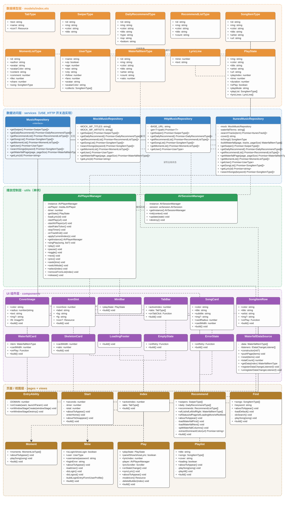
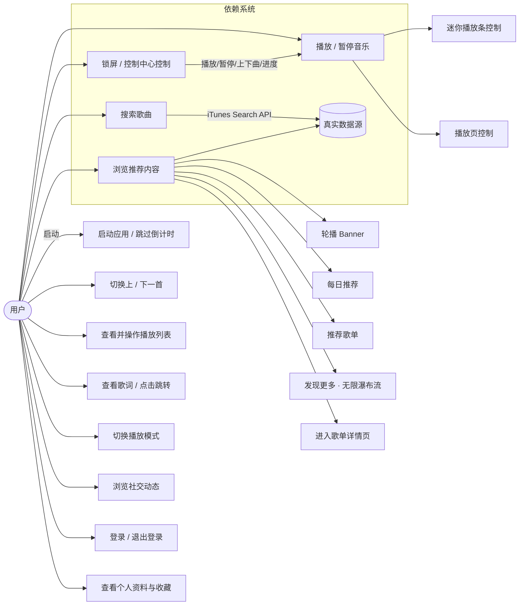
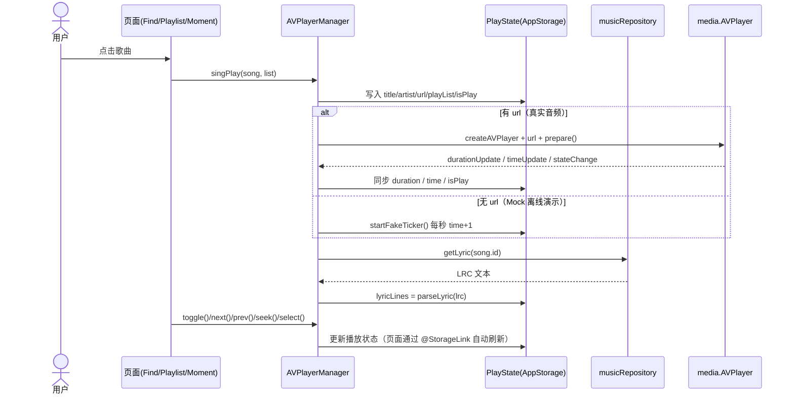

# 黑马云音乐 · 类图与用例图

> 基于当前代码（`entry/src/main/ets`）绘制的 UML 图，包含类属性、方法以及用例的执行调用链。
> 类图合并为一张图片（`docs/class-diagram.svg`），用例图使用 Mermaid 语法。

---

## 一、整体分层架构

```
┌─────────────────────────────────────────────────────────────┐
│  UI 层（pages / views / components）                         │
│  Start · Index · Play · Playlist                            │
│  Recommend · Find · Moment · Mine                           │
│  MiniBar · TabBar · SongCard · SongItemRow · Waterfall...    │
└───────────────┬─────────────────────────────────────────────┘
                │ 调用（页面只依赖接口，不感知数据来源）
┌───────────────▼─────────────────────────────────────────────┐
│  服务层（services）                                           │
│  «interface» MusicRepository                                 │
│  MockMusicRepository / HttpMusicRepository / ItunesMusicRepo │
└───────────────┬─────────────────────────────────────────────┘
                │
┌───────────────▼─────────────────────────────────────────────┐
│  数据源：iTunes Search API（真实）/ mock/data.ets（本地）      │
└───────────────┬─────────────────────────────────────────────┘
                │
┌───────────────▼─────────────────────────────────────────────┐
│  播放控制（utils）+ 全局状态（models）                         │
│  AVPlayerManager / AVSessionManager / PlayState(AppStorage)  │
└─────────────────────────────────────────────────────────────┘
```

---

## 二、类图

全部 37 个类合并为**一张图片**（`docs/class-diagram.svg`，可放大查看），按层分区着色，含类的属性、方法与层间关系：

- **橙色区** · 数据模型层（`models/index.ets`）：`TabType` / `SwiperType` / `DailyRecommendType` / `RecommendListType` / `SongItemType` / `MomentListType` / `UserType` / `WaterfallItemType` / `LyricLine` / `PlayState`（@Observed 全局状态）
- **蓝色区** · 数据访问层（`services`）：`«interface» MusicRepository` + `MockMusicRepository` / `HttpMusicRepository` / `ItunesMusicRepository` 三个实现（空心三角=实现关系）
- **绿色区** · 播放控制层（`utils`）：`AVPlayerManager` / `AVSessionManager`（单例）
- **紫色区** · UI 组件层（`components`）：`CoverImage` / `IconSlot` / `MiniBar` / `TabBar` / `SongCard` / `SongItemRow` / `WaterfallCard` / `SkeletonCard` / `LoadingFooter` / `EmptyState` / `ErrorState` / `WaterfallDataSource`
- **黄色区** · 页面/视图层（`pages` + `views`）：`EntryAbility` / `Start` / `Index` / `Recommend` / `Find` / `Moment` / `Mine` / `Play` / `Playlist`



> 图片来源：`docs/class-diagram.mmd`（Mermaid 源码，可直接用 mermaid-cli 重新渲染成 PNG）。
> 另有纯函数：`parseLyric(lrc: string): LyricLine[]`（解析 LRC 文本 → 按时间升序的歌词行）、`formatTime(sec: number): string`（秒 → `mm:ss`）、`tintMatrix(color: string): number[]`（十六进制色 → 4x5 图标染色矩阵）。

---

## 三、用例图



### 3.1 用例执行调用链（谁调用谁）

| 用例 | 触发入口 | 调用链 |
|---|---|---|
| 启动应用 | `Start` 倒计时结束 / 点「跳过」 | `Start.enterHome()` → `router.replaceUrl('pages/Index')` |
| 浏览推荐内容 | `Recommend.aboutToAppear()` | 并行调 `musicRepository.getSwiper() / getDailyRecommend() / getRecommendList() / getWaterfallPage(1,N)`；轮播图异步 `extractDominantColor()` 提取主色 |
| 进入歌单详情 | 推荐页卡片 `onClick` | `router.pushUrl('pages/Playlist', { title })` → `Playlist.aboutToAppear()` → `musicRepository.searchSongs(title)` |
| 搜索歌曲 | `Find` 搜索框 `onSubmit` | `Find.doSearch()` → `musicRepository.searchSongs(kw)`（iTunes Search）→ 更新 `this.songs` |
| 播放单曲 | 歌曲行 `onPlay` / 动态内嵌歌 / 播放全部 | `AVPlayerManager.getInstance().singPlay(song, list)` → 写入 `PlayState`(AppStorage `SONG_KEY`) → `router.pushUrl('pages/Play')` |
| 播放/暂停 | `MiniBar` 按钮 / `Play` 主键 | `AVPlayerManager.toggle() → play()/pause()`（真实 URL 走 `media.AVPlayer`，否则模拟定时器） |
| 切歌 | `Play` 上一首/下一首 | `AVPlayerManager.prev()/next()` → `applyCurrentIndex()` → `startPlay()` + `loadLyric()` |
| 播放列表 | `Play` 右上列表键展开抽屉 | `this.panelShow` 切换；点击列表项 `AVPlayerManager.select(index)`；左滑删除 `removeFromList(index)` |
| 歌词 | `Play` 点击封面切换 / 进度驱动 | `loadLyric()` → `musicRepository.getLyric(id)` → `parseLyric()` → `Play.syncLyric()` 高亮当前行；点歌词行 `seek(line.time)` |
| 播放模式 | `Play` 模式键 | `AVPlayerManager.switchMode()`：auto → repeat → random 三态循环 |
| 锁屏控制 | 系统锁屏/控制中心 | `EntryAbility.onWindowStageCreate()` → `AVSessionManager.init(ctx)` 注册回调 → 回调驱动 `AVPlayerManager`；播放状态由 `Play.onStateChange()` → `AVSessionManager.update(state)` 同步 |
| 登录 | `Mine` 登录入口 → 表单 → 登录 | `Mine.doLogin()`（本地校验：用户名>6 位、密码>8 位）→ `loadUser()` → `musicRepository.getUser()` |
| 退出登录 | `Mine` 退出按钮 | `Mine.doLogout()` 重置本地状态 |

### 3.2 核心播放时序（播放一首歌）



---

## 四、关键设计说明

- **依赖倒置**：页面/组件只依赖 `MusicRepository` 接口，`USE_HTTP` 开关决定真实（`ItunesMusicRepository`）还是 `Mock` 实现，切换数据源零改动。
- **全局状态**：`PlayState` 为 `@Observed` 类，通过 `AppStorage(SONG_KEY)` + `@StorageLink` 在 `Play` 页、`MiniBar`、锁屏间共享。
- **单例**：`AVPlayerManager`、`AVSessionManager` 均为单例，全局唯一播放器与媒体会话。
- **瀑布流**：`Recommend` 用「奇偶拆分左右列」手动瀑布流 + `WaterfallDataSource` 数据源结构（供 `LazyForEach` 结构匹配），触底 `onReachEnd` 预加载下一页。
